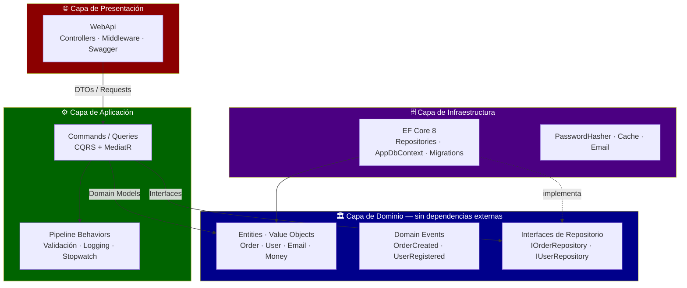

# .NET 8 Clean Architecture — Enterprise Reference Template

[](https://dotnet.microsoft.com)
[](https://docs.microsoft.com/en-us/dotnet/csharp)
[](https://docs.microsoft.com/en-us/ef/core)
[](https://www.postgresql.org)
[](https://www.docker.com)
[](https://xunit.net)
[](https://github.com/cdgutierrez6/dotnet-clean-arch/actions/workflows/ci.yml)

---

<details open>
<summary><h2>🇺🇸 English</h2></summary>

Reference template for enterprise APIs in **.NET 8** with Clean Architecture, CQRS, MediatR and EF Core. It applies the same patterns I used building real-time telemetry microservices at Satrack, packaged here as a self-contained reference.

> **Status & Scope** — This is a reference implementation / portfolio template, **not** a production service. There are no live users, SLAs or production data; the goal is to show a clean, testable .NET 8 architecture end to end.

---

### Architecture Layers


---

### Project Structure

```
dotnet-clean-arch/
├── src/
│   ├── CleanArch.Domain/              ← Business core (zero dependencies)
│   │   ├── Entities/
│   │   │   ├── BaseEntity.cs          # Domain events list
│   │   │   ├── User.cs
│   │   │   └── Order.cs               # State machine PENDING→CONFIRMED→SHIPPED
│   │   ├── ValueObjects/
│   │   │   ├── Email.cs               # Immutable record with regex validation
│   │   │   └── Money.cs               # Immutable record with currency
│   │   ├── Events/
│   │   │   ├── OrderCreatedEvent.cs
│   │   │   └── UserRegisteredEvent.cs
│   │   ├── Repositories/              ← Interfaces only (no implementations here)
│   │   │   ├── IUserRepository.cs
│   │   │   └── IOrderRepository.cs
│   │   └── Exceptions/
│   │       ├── DomainException.cs
│   │       └── NotFoundException.cs
│   │
│   ├── CleanArch.Application/         ← Use cases (CQRS)
│   │   ├── Commands/
│   │   │   ├── CreateOrder/
│   │   │   │   ├── CreateOrderCommand.cs
│   │   │   │   ├── CreateOrderHandler.cs
│   │   │   │   └── CreateOrderValidator.cs
│   │   │   └── RegisterUser/
│   │   │       ├── RegisterUserCommand.cs
│   │   │       ├── RegisterUserHandler.cs
│   │   │       └── RegisterUserValidator.cs
│   │   ├── Queries/
│   │   │   └── GetOrderById/
│   │   │       ├── GetOrderByIdQuery.cs
│   │   │       └── GetOrderByIdHandler.cs
│   │   ├── Behaviors/
│   │   │   ├── ValidationBehavior.cs  ← MediatR pipeline
│   │   │   └── LoggingBehavior.cs     ← Stopwatch per request
│   │   └── Common/
│   │       └── Result.cs              ← Result<T> (no exceptions for business errors)
│   │
│   ├── CleanArch.Infrastructure/      ← Technical implementations
│   │   ├── Persistence/
│   │   │   ├── AppDbContext.cs        # Dispatches domain events post-SaveChanges
│   │   │   ├── Configurations/        # IEntityTypeConfiguration per entity
│   │   │   └── Repositories/
│   │   ├── Services/
│   │   │   └── PasswordHasher.cs      # PBKDF2-SHA256 with salt
│   │   └── DependencyInjection.cs
│   │
│   └── CleanArch.WebApi/              ← Presentation layer
│       ├── Controllers/
│       │   ├── OrdersController.cs
│       │   └── UsersController.cs
│       ├── Middleware/
│       │   └── ErrorHandlingMiddleware.cs  # 422 / 404 / 400 by exception type
│       └── Program.cs                 # Serilog + auto-migrate on dev
│
└── tests/
    ├── CleanArch.Domain.Tests/        # Pure domain logic — no mocks needed
    ├── CleanArch.Application.Tests/   # Handlers — Moq + FluentAssertions
    └── CleanArch.Integration.Tests/   # EF Core + SQLite in-memory
```

---

### Quick Start

#### Prerequisites
- .NET 8 SDK
- Docker Desktop

#### Run with Docker

```bash
git clone https://github.com/cdgutierrez6/dotnet-clean-arch.git
cd dotnet-clean-arch

docker-compose up -d

# API available at:
# https://localhost:7001/swagger
```

#### Run without Docker

```bash
# Start PostgreSQL
docker run -d -p 5432:5432 -e POSTGRES_PASSWORD=dev123 postgres:15

# Apply migrations
dotnet ef database update \
  --project src/CleanArch.Infrastructure \
  --startup-project src/CleanArch.WebApi

# Run the API
dotnet run --project src/CleanArch.WebApi
```

---

### Patterns Implemented

| Pattern | Library | Purpose |
|---|---|---|
| **CQRS** | MediatR | Separate reads from writes |
| **Pipeline Behaviors** | MediatR | Cross-cutting validation and logging |
| **Repository** | EF Core | Persistence abstraction |
| **Unit of Work** | EF Core | Atomic transactions |
| **Domain Events** | MediatR | Decoupled side effects |
| **Result Pattern** | Custom | Error handling without exceptions |
| **Value Objects** | Domain | Immutability and self-validation |

---

### CQRS Example

```csharp
// Command — plain record, no logic
public record CreateOrderCommand(
    Guid UserId,
    List<OrderItemDto> Items
) : IRequest<Result<Guid>>;

// Handler — all business logic lives here
public class CreateOrderHandler : IRequestHandler<CreateOrderCommand, Result<Guid>>
{
    public async Task<Result<Guid>> Handle(
        CreateOrderCommand request, CancellationToken cancellationToken)
    {
        var user = await _userRepository.GetByIdAsync(request.UserId);
        if (user is null)
            return Result.Failure<Guid>(UserErrors.NotFound);

        var order = Order.Create(user.Id, request.Items.Select(MapToDomain));

        await _orderRepository.AddAsync(order);
        await _unitOfWork.SaveChangesAsync(cancellationToken);
        // Domain events dispatched automatically after SaveChanges

        return Result.Success(order.Id);
    }
}
```

---

### Running Tests

```bash
# Run all test projects
dotnet test

# Verbose output with test names
dotnet test --verbosity normal

# With code coverage (generates XML report)
dotnet test --collect:"XPlat Code Coverage" --results-directory ./coverage

# Run a specific project
dotnet test tests/CleanArch.Application.Tests
dotnet test tests/CleanArch.Domain.Tests

# Watch mode — re-runs on every file save
dotnet watch test --project tests/CleanArch.Application.Tests
```

| Test project | Type | Tools | What it covers |
|---|---|---|---|
| `CleanArch.Domain.Tests` | Unit | xUnit | Value Objects, Order state machine, domain rules — zero mocks needed |
| `CleanArch.Application.Tests` | Unit | xUnit + Moq + FluentAssertions | Command/Query handlers, validation behaviors |
| `CleanArch.Integration.Tests` | Integration | EF Core + SQLite in-memory | Repository implementations, DB constraints |

**Example test:**

```csharp
[Fact]
public void Order_Confirm_WhenPending_ShouldTransitionToConfirmed()
{
    // Arrange
    var order = Order.Create(Guid.NewGuid(), new List<OrderItem>
    {
        OrderItem.Create("Product A", 2, Money.From(10.00m, "USD"))
    });

    // Act
    order.Confirm();

    // Assert
    order.Status.Should().Be(OrderStatus.Confirmed);
    order.UpdatedAt.Should().NotBeNull();
}

[Theory]
[InlineData("valid@email.com", true)]
[InlineData("not-an-email", false)]
[InlineData("", false)]
public void Email_Validation_ShouldMatchExpected(string value, bool isValid)
{
    var result = Email.TryCreate(value, out var email);
    result.Should().Be(isValid);
}
```

---

### Technologies

- **.NET 8** + **C# 12**
- **MediatR** (CQRS + Pipeline Behaviors)
- **Entity Framework Core 8**
- **FluentValidation**
- **Serilog** (structured logging)
- **PostgreSQL** (production) / **SQLite** (tests)
- **Redis** (cache)
- **xUnit** + **FluentAssertions** + **Moq** (testing)
- **Swagger / OpenAPI**

---

### Background

The patterns in this template mirror those I applied building real-time telemetry microservices at **Satrack** (2022–2025), where Clean Architecture, DDD and CQRS/MediatR kept a high-throughput system testable and maintainable. This repository packages those patterns as a clean, self-contained reference — it is a template, not that production system.

---

### Author

**Cristian Daniel Gutiérrez S.** — Solutions Architect | Senior .NET Engineer

[LinkedIn](https://www.linkedin.com/in/cristian-daniel-guti%C3%A9rrez-segura) · [Portfolio](https://portafolio-frontend-wheat.vercel.app) · [cdgutierrez6@gmail.com](mailto:cdgutierrez6@gmail.com)

</details>

---

<details>
<summary><h2>🇨🇴 Español</h2></summary>

Template de referencia para APIs enterprise en **.NET 8** con Clean Architecture, CQRS, MediatR y EF Core. Aplica los mismos patrones que usé construyendo microservicios de telemetría en tiempo real en Satrack, empaquetados aquí como referencia autocontenida.

> **Estado y Alcance** — Es una implementación de referencia / template de portafolio, **no** un servicio en producción. No hay usuarios reales, SLAs ni datos productivos; el objetivo es mostrar una arquitectura .NET 8 limpia y testeable de punta a punta.

---

### Capas de la Arquitectura



---

### Estructura del Proyecto

```
dotnet-clean-arch/
├── src/
│   ├── CleanArch.Domain/              ← Núcleo de negocio (sin dependencias)
│   │   ├── Entities/
│   │   │   ├── BaseEntity.cs          # Lista de domain events
│   │   │   ├── User.cs
│   │   │   └── Order.cs               # Máquina de estados PENDING→CONFIRMED→SHIPPED
│   │   ├── ValueObjects/
│   │   │   ├── Email.cs               # Record inmutable con validación regex
│   │   │   └── Money.cs               # Record inmutable con moneda
│   │   ├── Events/
│   │   │   ├── OrderCreatedEvent.cs
│   │   │   └── UserRegisteredEvent.cs
│   │   ├── Repositories/              ← Solo interfaces (sin implementaciones aquí)
│   │   │   ├── IUserRepository.cs
│   │   │   └── IOrderRepository.cs
│   │   └── Exceptions/
│   │       ├── DomainException.cs
│   │       └── NotFoundException.cs
│   │
│   ├── CleanArch.Application/         ← Casos de uso (CQRS)
│   │   ├── Commands/
│   │   │   ├── CreateOrder/
│   │   │   └── RegisterUser/
│   │   ├── Queries/
│   │   │   └── GetOrderById/
│   │   ├── Behaviors/
│   │   │   ├── ValidationBehavior.cs  ← Pipeline MediatR
│   │   │   └── LoggingBehavior.cs     ← Stopwatch por request
│   │   └── Common/
│   │       └── Result.cs              ← Result<T> (sin excepciones para errores de negocio)
│   │
│   ├── CleanArch.Infrastructure/      ← Implementaciones técnicas
│   │   ├── Persistence/
│   │   │   ├── AppDbContext.cs        # Despacha domain events post-SaveChanges
│   │   │   ├── Configurations/        # IEntityTypeConfiguration por entidad
│   │   │   └── Repositories/
│   │   ├── Services/
│   │   │   └── PasswordHasher.cs      # PBKDF2-SHA256 con salt
│   │   └── DependencyInjection.cs
│   │
│   └── CleanArch.WebApi/              ← Capa de presentación
│       ├── Controllers/
│       ├── Middleware/
│       │   └── ErrorHandlingMiddleware.cs  # 422 / 404 / 400 por tipo de excepción
│       └── Program.cs                 # Serilog + auto-migrate en dev
│
└── tests/
    ├── CleanArch.Domain.Tests/        # Lógica de dominio pura — sin mocks necesarios
    ├── CleanArch.Application.Tests/   # Handlers — Moq + FluentAssertions
    └── CleanArch.Integration.Tests/   # EF Core + SQLite in-memory
```

---

### Inicio Rápido

#### Prerrequisitos
- .NET 8 SDK
- Docker Desktop

#### Levantar con Docker

```bash
git clone https://github.com/cdgutierrez6/dotnet-clean-arch.git
cd dotnet-clean-arch

docker-compose up -d

# API disponible en:
# https://localhost:7001/swagger
```

#### Sin Docker

```bash
# Levantar PostgreSQL
docker run -d -p 5432:5432 -e POSTGRES_PASSWORD=dev123 postgres:15

# Aplicar migraciones
dotnet ef database update \
  --project src/CleanArch.Infrastructure \
  --startup-project src/CleanArch.WebApi

# Correr la API
dotnet run --project src/CleanArch.WebApi
```

---

### Patrones Implementados

| Patrón | Librería | Propósito |
|---|---|---|
| **CQRS** | MediatR | Separar lecturas de escrituras |
| **Pipeline Behaviors** | MediatR | Validación y logging transversales |
| **Repository** | EF Core | Abstracción de persistencia |
| **Unit of Work** | EF Core | Transacciones atómicas |
| **Domain Events** | MediatR | Desacoplamiento de efectos secundarios |
| **Result Pattern** | Custom | Manejo de errores sin excepciones |
| **Value Objects** | Domain | Inmutabilidad y auto-validación |

---

### Ejemplo CQRS

```csharp
// Command — record plano, sin lógica
public record CreateOrderCommand(
    Guid UserId,
    List<OrderItemDto> Items
) : IRequest<Result<Guid>>;

// Handler — toda la lógica de negocio vive aquí
public class CreateOrderHandler : IRequestHandler<CreateOrderCommand, Result<Guid>>
{
    public async Task<Result<Guid>> Handle(
        CreateOrderCommand request, CancellationToken cancellationToken)
    {
        var user = await _userRepository.GetByIdAsync(request.UserId);
        if (user is null)
            return Result.Failure<Guid>(UserErrors.NotFound);

        var order = Order.Create(user.Id, request.Items.Select(MapToDomain));

        await _orderRepository.AddAsync(order);
        await _unitOfWork.SaveChangesAsync(cancellationToken);
        // Domain events publicados automáticamente después de SaveChanges

        return Result.Success(order.Id);
    }
}
```

---

### Correr Tests

```bash
# Correr todos los proyectos de test
dotnet test

# Output detallado con nombres de test
dotnet test --verbosity normal

# Con reporte de cobertura (genera XML)
dotnet test --collect:"XPlat Code Coverage" --results-directory ./coverage

# Proyecto específico
dotnet test tests/CleanArch.Application.Tests
dotnet test tests/CleanArch.Domain.Tests

# Watch mode — re-corre en cada guardado de archivo
dotnet watch test --project tests/CleanArch.Application.Tests
```

| Proyecto de test | Tipo | Herramientas | Qué cubre |
|---|---|---|---|
| `CleanArch.Domain.Tests` | Unit | xUnit | Value Objects, máquina de estados de Order, reglas de dominio — sin mocks |
| `CleanArch.Application.Tests` | Unit | xUnit + Moq + FluentAssertions | Handlers de Commands/Queries, validation behaviors |
| `CleanArch.Integration.Tests` | Integración | EF Core + SQLite in-memory | Implementaciones de repositorios, constraints de BD |

**Ejemplo de test:**

```csharp
[Fact]
public void Order_Confirm_WhenPending_ShouldTransitionToConfirmed()
{
    // Arrange
    var order = Order.Create(Guid.NewGuid(), new List<OrderItem>
    {
        OrderItem.Create("Producto A", 2, Money.From(10.00m, "USD"))
    });

    // Act
    order.Confirm();

    // Assert
    order.Status.Should().Be(OrderStatus.Confirmed);
    order.UpdatedAt.Should().NotBeNull();
}
```

---

### Tecnologías

- **.NET 8** + **C# 12**
- **MediatR** (CQRS + Pipeline Behaviors)
- **Entity Framework Core 8**
- **FluentValidation**
- **Serilog** (structured logging)
- **PostgreSQL** (producción) / **SQLite** (tests)
- **Redis** (cache)
- **xUnit** + **FluentAssertions** + **Moq** (testing)
- **Swagger / OpenAPI**

---

### Contexto

Los patrones de este template reflejan los que apliqué construyendo microservicios de telemetría en tiempo real en **Satrack** (2022–2025), donde Clean Architecture, DDD y CQRS/MediatR mantuvieron testeable y mantenible un sistema de alto volumen. Este repositorio empaqueta esos patrones como una referencia limpia y autocontenida — es un template, no ese sistema de producción.

---

### Autor

**Cristian Daniel Gutiérrez S.** — Solutions Architect | Senior .NET Engineer

[LinkedIn](https://www.linkedin.com/in/cristian-daniel-guti%C3%A9rrez-segura) · [Portfolio](https://portafolio-frontend-wheat.vercel.app) · [cdgutierrez6@gmail.com](mailto:cdgutierrez6@gmail.com)

</details>
